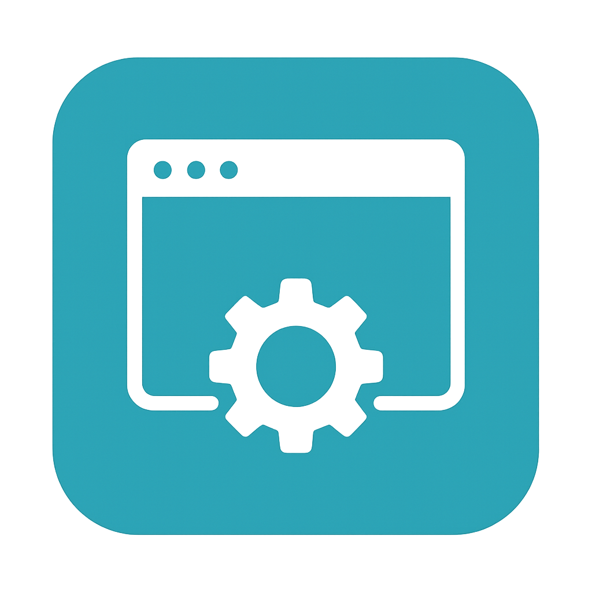

## AutoWK 自动化浏览器框架
> 🚀 一个基于原生 WebKit二次开发的自动化浏览器框架，自带指纹反检测浏览器，支持命令行参数控制窗口位置与代理配置，并通过 Python 客户端驱动自动操作浏览器。

> 😈 可以改写为任何语言的绑定，使用GPT转化为对应语言即可。
<p align="center">
  
</p>

## ✨ 项目亮点

- ✅ 🧠 基于 `WebKit` 源码构建，小而精致的浏览器内核
- ✅ 🛠️ 支持全屏幕截图，`长图`自动一键截图
- ✅ 💪 网络改造，支持 `HTTP/SOCKS5` 等密码代理模式
- ✅ 📏 `Python API` 调用控制浏览器行为，可以改写为任何语言的绑定
- ✅ 🧪 人类行为模拟，底层行为重写，自定义行为动作都是`isTrusted`
- ✅ 📁 每个`窗口隔离`，支持自定义缓存、数据库、本地存储和Cookie路径
- ✅ 🧿 关键`指纹`修改，规避指纹检测，动态修改指纹
- ✅ 🪄 实现对`shadow root`的访问，包括closed的节点，过shadowroot检测
- ✅ 👻 实现`无头模式`，不渲染窗体，WebKit 基础上再添极致性能
- ✅ 🧟 实现`数据包监听`，实现对请求包和响应包，网络层数据包拦截
---


## 快速开始(目前仅支持独显)
> 🚀 交流群QQ：391116392
1. 安装依赖：

   ```bash
   pip install autowk==0.4.2
   ```

2. 编写代码，启动自动化：

### 示例代码 ：过steam的定制5s盾
```python
from autowk.AutoWkDriverClient import AutoWK
import time

if __name__ == "__main__":
    client = AutoWK(lang="en-US",timezone="America/Chicago")
    try:
        client.create_session()

        print("[STATUS]", client.status())

        client.set_timeouts({"pageLoad": 10000})
        print("[GET TIMEOUTS]", client.get_timeouts())
        
        client.navigate(r"https://steamdb.info/")
        print("[URL]", client.get_current_url())

        time.sleep(10)
        #坐标直接用操作系统的截图，然后画板打开看x和y坐标，浏览器左上角是坐标0,0
        client.click_pos_by_win(266,326)
        print('拖拽完毕')


    except Exception as e:
        print(e)

    finally:
        time.sleep(500)
        client.delete_session()
        client.close()
```
### 示例代码 ：过12306滑块验证码
```python
from autowk.AutoWkDriverClient import AutoWK
import time

"""自动化1236滑块验证码"""
client = AutoWK(lang="en-US",timezone="America/Chicago")try:
client.create_session()

print("[STATUS]", client.status())

client.set_timeouts({"pageLoad": 10000})
print("[GET TIMEOUTS]", client.get_timeouts())

client.navigate(r"https://www.12306.cn/index/view/infos/ticket_check.html")
print("[URL]", client.get_current_url())

#输入座次
input_ele=client.find_element_by_css_selector("input#ticket_check_trainNum").input("1462")

time.sleep(3)
#选择地点
drap=client.find_element_by_css_selector("div.model-select-text")
drap.set_attribute("data-value","TXP")
print('attr:', drap.get_attribute("data-value"))
print('选择完毕')

time.sleep(3)
#拖拽滑块验证码
btn=client.find_element_by_css_selector("li a.btn.btn-primary").click()
time.sleep(5)
#拖拽滑块验证码，这里用的是拖拽模拟人类行为，所以用的是drag_and_drop_pos_human方法
#坐标需要自己定位一下
client.drag_and_drop_pos_human(525,436,848,436)
print('拖拽完毕')
```
### 示例代码 ：切换iframe，并操作iframe元素
```python
from autowk.AutoWkDriverClient import AutoWK
import time

client = AutoWK()
client.create_session()

print("[STATUS]", client.status())

client.set_timeouts({"pageLoad": 10000})
print("[GET TIMEOUTS]", client.get_timeouts())
client.navigate(r"")

#本地测试html文件，需要自己改成自己的路径，可以从testhtml获取HTML文件路径
client.navigate(r"file://D:\\Python\\pycode\\2025\\autowk\\testhtml\\frame.html")
print("[URL]", client.get_current_url())

time.sleep(2)
frame_ele=client.find_element_by_css_selector("#innerFrame")
print("[FRAME]", frame_ele)
res=client.switch_to_frame(frame_ele)
print("[SWITCH TO FRAME]", res)

input_ele=client.find_element_by_css_selector("#ruyi")
input_ele.input("ruyiinput")

cli_ele=client.find_element_by_css_selector("#ruyiclick")
cli_ele.click()
print("clicked")
time.sleep(3)
input_ele.clear()
```

### 示例代码 ：切换shadowroot，并操作shadow元素
```python
from autowk.AutoWkDriverClient import AutoWK
import time

client = AutoWK()
client.create_session()

print("[STATUS]", client.status())

client.set_timeouts({"pageLoad": 10000})
print("[GET TIMEOUTS]", client.get_timeouts())
client.navigate(r"")

client.navigate(r"file://D:\\Python\\pycode\\2025\\autowk\\testhtml\\shadowroot.html")
print("[URL]", client.get_current_url())

time.sleep(2)
#open状态的shadowroot
# host_ele=client.find_element_by_css_selector("#host").get_shadow_root()
# print("[SHADOW]", host_ele)
# cli_ele=host_ele.find_element_by_css_selector("#clickable").click()
# print("[CLICKABLE]",cli_ele)

#closed状态的shadowroot
host_ele=client.get_closed_shadow_root("#host")
print("[SHADOW CLOSED]", host_ele)
host_ele.find_element_by_css_selector("#clickable").click()
print("[CLOSED CLICKABLE]")
```
---

#### 支持的启动命令行参数（MiniBrowser.exe）

| 参数                 | 示例                                                                 | 说明                         |
|--------------------|--------------------------------------------------------------------|----------------------------|
| `--x=`             | `--x=100`                                                          | 设置窗口左上角 X 坐标               |
| `--y=`             | `--y=200`                                                          | 设置窗口左上角 Y 坐标               |
| `--width=`         | `--width=1280`                                                     | 设置窗口宽度                     |
| `--height=`        | `--height=720`                                                     | 设置窗口高度                     |
| `--height=`        | `--height=720`                                                     | 设置窗口高度                     |
| 语言时区               | ----------------------------------                                 | -------------------------- |
| `--lang=`          | `--lang=en-US`                                                     | 设置浏览器内部所有语言                |
| `--timezone=`      | `--timezone=America/Chicago`                                       | 设置浏览器内部时区                  |
| 密码代理               | ----------------------------------                                 | -------------------------- |
| `--proxyType=`     | `--proxyType=HTTP`                                                 | 代理类型：`HTTP` / `SOCKS5` 等   |
| `--proxyHost=`     | `--proxyHost=127.0.0.1`                                            | 代理服务器地址                    |
| `--proxyPort=`     | `--proxyPort=1080`                                                 | 代理端口                       |
| `--proxyUsername=` | `--proxyUsername=admin`                                            | 代理认证用户名                    |
| `--proxyPassword=` | `--proxyPassword=123456`                                           | 代理认证密码                     |
| 启动页面               | ----------------------------------                                 | -------------------------- |
| `--url=`           | `--url=https://www.baidu.com`                                      | 设置启动页面                     |
| 窗口数据隔离             | ----------------------------------                                 | -------------------------- |
| `--userDataDir=`   | `--userDataDir=C://webdata//1` <br/>`--userDataDir=C://webdata//2` | 设置用户缓存目录                   |
| 指纹修改配置文件           | ----------------------------------                                 | -------------------------- |
| `--fpfile=`        | `--fpfile=C:\webkit\fp_config1.txt`                                | 设置指纹配置文件                   |
| 设置UA               | ----------------------------------                                 | -------------------------- |
| `--userAgent=`     | `--userAgent=webkit`                                               | 设置UA                       |
| 无头模式               | ----------------------------------                                 | -------------------------- |
| `--headless`       | `--headless`                                                       | 直接添加即开启无头模式                |
| 监听数据包      | ----------------------------------                                 | -------------------------- |
| `--enableListen`       | `--enableListen`    | 开启模式监听                     |
| `--networkListenPort`   | `--networkListenPort=12980` | 监听   端口                    |
#### 无密码代理
```bash
minibrowser.exe --proxyType=http  --proxyHost=127.0.0.1  --proxyPort=7890 
```
#### 密码代理
```cmd
例子:minibrowser.exe --proxyType=SOCKS5  --proxyHost=1.1.1.1  --proxyPort=1000 --proxyUsername=ruyi  --proxyPassword=wifi 
```
---


## 支持的指纹修改参数

| 参数                                         | 示例                          | 说明                                                         | 可选值/范围                          |
| -------------------------------------------- | ----------------------------- | ------------------------------------------------------------ | ------------------------------------- |
| **unmasked_renderer**                        | `Apple GPU`                   | 显卡型号（WebGL UNMASKED_RENDERER）                          | 任意字符串                           |
| **unmasked_vendor**                          | `Apple Inc.`                  | 显卡厂商（WebGL UNMASKED_VENDOR）                             | 任意字符串                           |
| **canvas_noise**                             | `10`                          | Canvas 噪声种子，影响 toDataURL/getImageData 返回像素         | 任意整数，不同数值对应不同噪声         |
| **clientrect_noise**                         | `2`                           | ClientRect DOM 矩形尺寸噪声                                  | 整数，0 表示不加噪声                   |
| **hardwareConcurrency**                      | `8`                           | CPU 核心数，navigator.hardwareConcurrency                     | 正整数，建议 1~128                    |
| **maxTouchPoints**                           | `5`                           | 支持的触摸点数，navigator.maxTouchPoints                     | 0（无触摸）或正整数                    |

---

## Canvas 初始化参数（影响 2D/WebGL 上下文创建）

| 参数                                         | 示例                          | 说明                                                         | 可选值/范围                          |
| -------------------------------------------- | ----------------------------- | ------------------------------------------------------------ | ------------------------------------- |
| **canvas_alpha**                             | `0`                           | 是否透明                                                     | `0`（不透明）、`1`（透明）            |
| **canvas_depth**                             | `1`                           | 是否启用深度缓冲                                             | `0` 或 `1`                           |
| **canvas_stencil**                           | `0`                           | 是否启用模板缓冲                                             | `0` 或 `1`                           |
| **canvas_antialias**                         | `1`                           | 是否抗锯齿                                                   | `0` 或 `1`                           |
| **canvas_premultipliedAlpha**                | `0`                           | 是否 premultipliedAlpha                                      | `0` 或 `1`                           |
| **canvas_preserveDrawingBuffer**             | `0`                           | 是否保留绘图缓冲                                             | `0` 或 `1`                           |
| **canvas_failIfMajorPerformanceCaveat**      | `0`                           | 若性能较差是否拒绝创建 WebGL                                 | `0` 或 `1`                           |
| **canvas_powerPreference**                   | `high-performance`            | 电源优先级                                                   | `high-performance` / `low-power` / `default` |

---

## OpenGL/WebGL 状态（Capabilities）

| 参数                                         | 示例                          | 说明                                                         | 可选值/范围                          |
| -------------------------------------------- | ----------------------------- | ------------------------------------------------------------ | ------------------------------------- |
| **gl_cap_GL_BLEND**                          | `1`                           | 是否启用混合                                                 | `0` 或 `1`                           |
| **gl_cap_GL_CULL_FACE**                       | `1`                           | 是否启用背面剔除                                             | `0` 或 `1`                           |
| **gl_cap_GL_DEPTH_TEST**                      | `1`                           | 是否启用深度测试                                             | `0` 或 `1`                           |
| **gl_cap_GL_DITHER**                          | `1`                           | 是否启用抖动                                                 | `0` 或 `1`                           |
| **gl_cap_GL_POLYGON_OFFSET_FILL**             | `1`                           | 是否启用多边形偏移填充                                       | `0` 或 `1`                           |
| **gl_cap_GL_SAMPLE_ALPHA_TO_COVERAGE**        | `1`                           | 是否启用透明度到覆盖                                         | `0` 或 `1`                           |
| **gl_cap_GL_SAMPLE_COVERAGE**                 | `1`                           | 是否启用采样覆盖                                             | `0` 或 `1`                           |
| **gl_cap_GL_SCISSOR_TEST**                    | `1`                           | 是否启用裁剪测试                                             | `0` 或 `1`                           |
| **gl_cap_GL_STENCIL_TEST**                    | `1`                           | 是否启用模板测试                                             | `0` 或 `1`                           |
| **gl_cap_GL_RASTERIZER_DISCARD**              | `1`                           | 是否启用光栅化丢弃                                           | `0` 或 `1`                           |

---

## WebGL 参数（通过 getParameter 获取）

| 参数                                         | 示例                          | 说明                                                         | 可选值/范围                          |
| -------------------------------------------- | ----------------------------- | ------------------------------------------------------------ | ------------------------------------- |
| **webgl_param_UNMASKED_RENDERER_WEBGL**      | `AMD Fake Renderer`           | 显卡渲染器名称（UNMASKED_RENDERER_WEBGL）                    | 任意字符串                           |
| **webgl_param_UNMASKED_VENDOR_WEBGL**        | `FakeVendor Inc.`             | 厂商名称（UNMASKED_VENDOR_WEBGL）                            | 任意字符串                           |
| **webgl_param_DEPTH_BITS**                   | `24`                          | 深度缓冲区位数                                               | 0、8、16、24、32                     |
| **webgl_param_MAX_TEXTURE_SIZE**             | `4096`                        | 最大纹理尺寸                                                 | 2 的幂，通常 512~16384               |
| **webgl_param_MAX_VIEWPORT_DIMS**            | `4096`                        | 最大视口尺寸（宽高相同）                                     | 通常 512~16384                       |
| **webgl_param_DEPTH_TEST**                   | `true`                        | 是否启用深度测试                                             | `true` 或 `false`                    |

---

fp_config1.txt配置文件示例：

```txt
unmasked_renderer=Apple GPU
unmasked_vendor=Apple Inc.
canvas_noise=500
clientrect_noise=20
hardwareConcurrency=16
maxTouchPoints=0

canvas_alpha=0
canvas_depth=0
canvas_stencil=0
canvas_antialias=1
canvas_premultipliedAlpha=0
canvas_preserveDrawingBuffer=0
canvas_failIfMajorPerformanceCaveat=0
canvas_powerPreference=high-performance

gl_cap_GL_BLEND=1
gl_cap_GL_CULL_FACE=1
gl_cap_GL_DEPTH_TEST=1
gl_cap_GL_DITHER=1
gl_cap_GL_POLYGON_OFFSET_FILL=1
gl_cap_GL_SAMPLE_ALPHA_TO_COVERAGE=1
gl_cap_GL_SAMPLE_COVERAGE=1
gl_cap_GL_SCISSOR_TEST=1
gl_cap_GL_STENCIL_TEST=1
gl_cap_GL_RASTERIZER_DISCARD=1

webgl_param_UNMASKED_RENDERER_WEBGL=AMD Fake Renderer
webgl_param_UNMASKED_VENDOR_WEBGL=FakeVendor Inc.
webgl_param_DEPTH_BITS=14
webgl_param_MAX_TEXTURE_SIZE=1024
webgl_param_MAX_VIEWPORT_DIMS=1024
webgl_param_DEPTH_TEST=true
```
##### ** 如果是手机UA的话，maxTouchPoints需要设置，如果是PC，maxTouchPoints设置0

---

# `AutoWK` 接口方法说明

继承自 `AutoWKBase`，`AutoWkDriverClient`提供了 WebKit 浏览器的自动化操作封装。

---

## ✅ 初始化方法

### `__init__(host="127.0.0.1", port=12345, x=0, y=0, width=10, height=10, lang="en-US", timezone="America/Chicago")`
初始化 WebKit 实例，连接到指定端口并设置视图和语言。

---

## 🍪 Cookie 操作

### `get_all_cookies()`
获取当前会话所有 Cookie。

### `get_cookie_by_name(name)`
获取指定名称的 Cookie。

- `name`: Cookie 名称（字符串）

### `add_cookie(cookie)`
添加一个 Cookie。

- `cookie`: 字典，需包含 name、value、domain、path 等键

### `delete_cookie(name)`
删除指定名称的 Cookie。

### `delete_all_cookies()`
删除当前页面的所有 Cookie。

---

## 💾 存储与清理

### `clear_websitedata()`
清理网站数据。

---

## 🔄 会话与状态

### `status()`
获取 WebDriver 服务状态。

### `get_timeouts()`
获取当前超时设置。

### `set_timeouts(timeouts)`
设置超时时间。

- `timeouts`: 包含 `script`, `pageLoad`, `implicit` 的字典

### `wait_for_element(using, selector,timeout: float = 10.0, interval: float = 0.5)`
等待元素出现，返回等待的元素。

- `using`: 包含 `css selector`, `xpath`两种模式
- `selector`: 使用的具体查询规则
- `timeout`: 等待时间
- `interval`: 轮询间隔

---

## 🌐 页面控制

### `navigate(url)`
跳转到指定 URL。

### `get_current_url()`
获取当前页面 URL。

### `get_useragent()`
获取当前 User-Agent。

### `set_useragent(useragent_name)`
设置 User-Agent。

---

## 🔙 页面导航

### `back()`
浏览器后退。

### `forward()`
浏览器前进。

### `refresh()`
刷新当前页面。

---

## 📄 页面信息

### `get_title()`
获取页面标题。

### `get_page_source()`
获取页面 HTML 源码。

---

## 🪟 窗口控制

### `maximize_window()`
最大化窗口。

### `minimize_window()`
最小化窗口。

### `get_window_rect()`
获取窗口的位置和大小。

### `set_window_rect(x=None, y=None, width=None, height=None)`
设置窗口的位置和大小。

### `get_window_handles()`
获取所有窗口句柄。

### `get_window_handle()`
获取当前窗口句柄。

### `close_window()`
关闭当前窗口。

### `switch_to_window(handle)`
切换到指定窗口。

### `new_window(window_type="tab")`
创建新窗口或标签页。

---

## 📜 脚本执行

### `execute_script(script, args=[])`
执行 JavaScript 脚本并返回结果。

---
### `get_closed_shadow_root(self,css_selector)`
- **说明**：获取关闭状态的shadow root。
- **参数**：获取节点的css语法规则。
- **返回**：shadowroot节点。

---

## 📷 截图

### `take_screenshot(filename="screenshot.png")`
对当前页面截图保存为文件。

---

## 🧱 Frame 操作

### `switch_to_frame(iframe)`
切换到指定 iframe。支持传入 Element 或 ID。

### `switch_to_parent_frame()`
切换到当前iframe的父窗口。
---

## 🔍 元素查找

### `find_element_by_css_selector(selector)`
通过 CSS 选择器查找元素。

### `find_elements_by_css_selector(selector)`
通过 CSS 选择器查找多个元素。

### `find_element_by_xpath(selector)`
通过 XPath 查找元素。

### `find_elements_by_xpath(selector)`
通过 XPath 查找多个元素。

---

## 🖱️ 鼠标点击

### `click_pos_by_js(x, y)`
使用 JavaScript 方式点击页面上的指定位置。

### `click_pos_by_win(x, y)`
使用 WebDriver Actions API 模拟点击。

---

## 📦 拖拽操作

### `drag_and_drop_pos(start_x, start_y, end_x, end_y)`
模拟从起点拖拽到终点（标准 WebDriver 操作）。

### `drag_and_drop_pos_human(start_x, start_y, end_x, end_y, num_steps=30)`
模拟人类手势的拖拽（使用贝塞尔曲线+缓动插值）。

---

## 📌 附加说明

- 所有函数默认使用当前 `session_id`，请确保已成功连接 WebDriver。
- 返回值通常为 `dict`，或直接返回值（如元素对象、URL、标题等）。


## Element 类方法接口说明

### `get_attribute(name)`
- **说明**：获取元素的属性值。
- **参数**：
  - `name`：属性名称。
- **返回**：属性值。

---

### `set_attribute(attribute_name, value)`
- **说明**：通过执行 JS 脚本设置元素的属性值。
- **参数**：
  - `attribute_name`：属性名称。
  - `value`：属性值。
- **返回**：`self`（链式调用）。

---

### `get_text()`
- **说明**：获取元素的文本内容。
- **返回**：字符串。

---

### `get_rect()`
- **说明**：获取元素的位置信息（x, y, width, height）。
- **返回**：字典对象。

---

### `is_displayed()`
- **说明**：判断元素是否可见。
- **返回**：布尔值。

---

### `click()`
- **说明**：模拟点击该元素。
- **返回**：响应结果。

---

### `clear()`
- **说明**：模拟清除输入框文字。
- **返回**：响应结果。

---

### `input(text)`
- **说明**：向输入框输入文字。
- **参数**：
  - `text`：要输入的文本。
- **返回**：响应结果。

---
### `get_open_shadow_root()`
- **说明**：获取开放状态的shadow root。
- **返回**：shadowroot节点。

---
### `take_element_screenshot(filename)`
- **说明**：截取元素图片。
- **返回**：None。

---

### `find_element_by_css(selector)`
- **说明**：通过 CSS 选择器查找当前元素下的第一个匹配子元素。
- **参数**：
  - `selector`：CSS 选择器字符串。
- **返回**：子元素对象或响应结果。

---

### `find_elements_by_css(selector)`
- **说明**：通过 CSS 选择器查找当前元素下的所有匹配子元素。
- **参数**：
  - `selector`：CSS 选择器字符串。
- **返回**：子元素列表或响应结果。

---

### `find_element_by_xpath(selector)`
- **说明**：通过 XPath 查找当前元素下的第一个匹配子元素。
- **参数**：
  - `selector`：XPath 表达式。
- **返回**：子元素对象或响应结果。

---

### `find_elements_by_xpath(selector)`
- **说明**：通过 XPath 查找当前元素下的所有匹配子元素。
- **参数**：
  - `selector`：XPath 表达式。
- **返回**：子元素列表或响应结果。

---

### `drag_element_by_offset_line(offset_x, offset_y)`
- **说明**：以直线方式拖拽元素指定偏移量。
- **参数**：
  - `offset_x`：水平方向偏移。
  - `offset_y`：垂直方向偏移。
- **返回**：响应结果。

---

### `drag_element_by_offset_human(offset_x, offset_y, num_steps=30)`
- **说明**：以人类操作风格（贝塞尔曲线 + ease-in-out）拖拽元素。
- **参数**：
  - `offset_x`：水平偏移。
  - `offset_y`：垂直偏移。
  - `num_steps`：拖动的步数（默认 30）。
- **返回**：响应结果。

